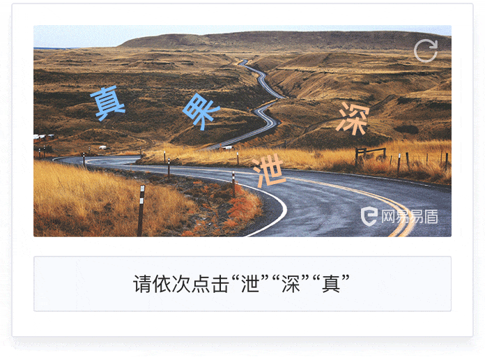

# 行为式验证码识别
[](<>)

本项目目的是使用深度学习来对行为式验证码进行机器识别，对此类验证码的安全性做一个整体评估。

:ok_man: 请勿用于非法用途！

:star: 如果对你有帮助的话，可以light up stars~

## 项目成果

滑块式验证码「极验」「易盾」「云片」通用模型测试集准确率99+%

点选式验证码「易盾」模型测试集TOP1准确率96%，TOP10准确率99+%

## 主目录结构

```
.
├── requirements.txt	# 所需环境
├── LICENSE
├── readme
├── README.md
├── behavior_simulation	# 「易盾」selenium模拟
├── click_captcha	# 点选式验证码
├── slider_captcha	# 滑块式验证码
├── spider_tools	# 爬虫通用工具
└── unfinished_click_captcha	# 未训练的点选平台
    ├── __init__.py
    ├── geetest
    └── yunpian
```

项目主要分为三个部分：（请分别进入查看对应md文档）

 * [滑块式验证码](./slider_captcha/README.md)
 * [点选式验证码](./click_captcha/README.md)
 * [接口+Selenium集成「易盾」平台展示](./behavior_simulation/README.md)


## 什么是行为式验证码？

行为式验证码目前主要分为滑块式和文字点选式。如下图所示：




相对于传统的图形验证码，行为式验证码相对来说用户体验更好，而且因为这种验证码由于加入了更多的干扰，并在背后搭载了风控模型，使得安全性更高，渐渐的成为了现在主流的验证方式。


## 识别大致流程

对于行为式验证码来说，传统的OCR识别或者简单的图像处理已经力不从心，故我们尝试使用新兴的深度学习来进行图像识别。

> **具体实现逻辑请参考主目录结构中对应目录内的md文档**


**深度学习的前提是都需要大量的数据集做支撑。**

### 对于滑块式验证码

关键是要找到滑块的缺口位置，再通过模拟行为轨迹来通过人机验证。

对于一些简单的图片，其实我们可以通过opencv计算相似度等方式来获得缺口，这个方式我们不讨论。

这里使用 YOLOV3 模型来识别滑动验证码缺口，YOLOV3将定位和分类直接转换成回归问题，速度快，并且对于识别滑块这种场景，我们只有一类。

### 对于点选式验证码

借鉴了很多实现后，文字定位同样可以采用YOLOV3算法，文字分类我们采用定义卷积网络来实现。最后再对PC端的鼠标行为轨迹进行模拟。

为什么不采用YOLOV3一步实现呢？

深度学习的学习其实是针对某一类输入，学习并泛化出指定的输出，这个学习过程对于每一类特征明显的训练集可以得到很好的效果，但对于直接对图片中的文字进行定位并认识它，这个学习成本是很高的。就好比我只有一个脑子，要我同时学中文和英语；和有两个人，一个人学中文，一个人学英语，使用同样的成本，哪个效果更好，也就显而易见了。再者说YOLOV3对于小目标的检测会相对较弱。

## 说明

项目不提供权重模型噢

如果需要「某盾」点选数据集的我可以免费发给你，但务必不要用于非法活动。

邮箱：yujunjiex@qq.com


## 参考项目

* [DeepLearningSlideCaptcha](https://github.com/Python3WebSpider/DeepLearningSlideCaptcha)

* [captcha_crack](https://github.com/cos120/captcha_crack/)

* [verification_code](https://github.com/huaiyukeji/verification_code)

* [gsxt_captcha](https://github.com/RunningGump/gsxt_captcha)


## 协议

本项目基于GNU开源协议，不得用于商业用途

本项目仅供学习交流使用，本人不承担任何法律责任

若有侵权请联系删除。

