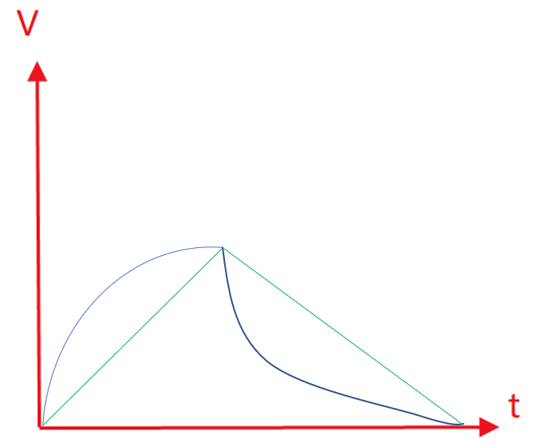
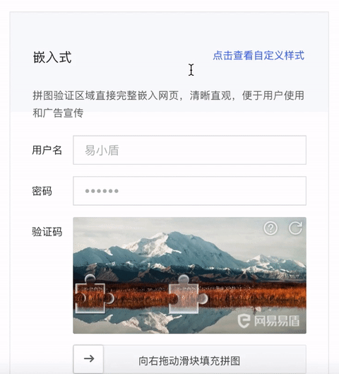
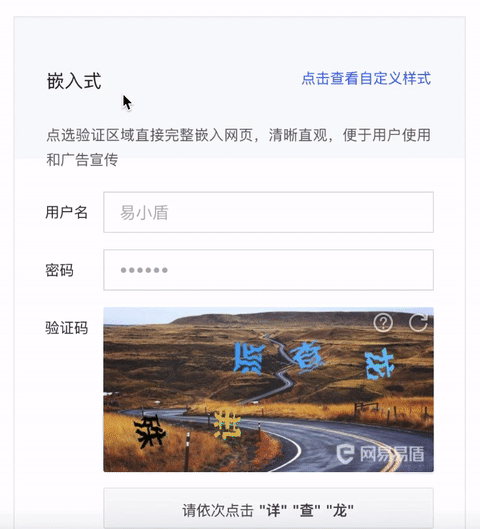

# 接口及集成模拟

为了直观展示模拟轨迹的有效性，采用selenium对「易盾」的行为验证码来进行模拟。

## 环境配置

1. 脚本中使用的chrome webdriver，请自行下载使用于自己chrome内核版本的webdriver
2. `server.py`集成了点选和滑块的crack方法。用Flask编写，对外提供了detect接口，使用方法见`demo.py`

## 轨迹模拟

### 滑块式

整体采用变加速度物理模型，并有如下优化操作：

* 划过缺口再回滑一段距离
* 模拟人手在y_offset的上下波动
* 滑块位置离左边有一定距离
* 浏览器中的图片是在原图基础上缩放的，某盾是320/480

### 点选式

一开始只进行文字位置的点击，发现点击的顺序和文字都是正确的，通过率却很低。故考虑到PC端的点选验证码也采用了轨迹验证（不愧叫行为式验证码:call_me_hand:）。网上调研并尝试多种曲线后，使用贝塞尔曲线中的easeOutBack类型能取得很好的效果，文字点选正确基本上都能通过。

easeOutBack曲线：https://easings.net/#easeOutBack

