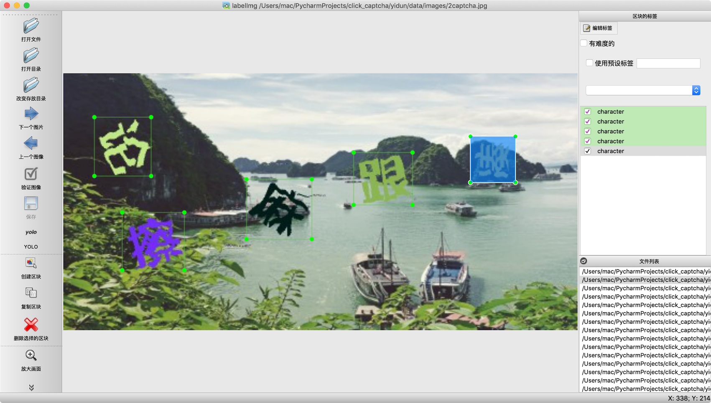
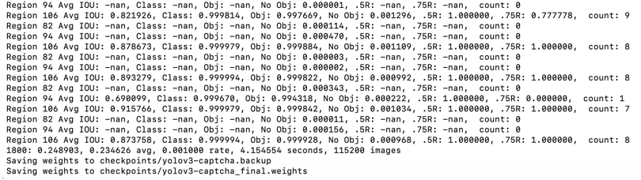
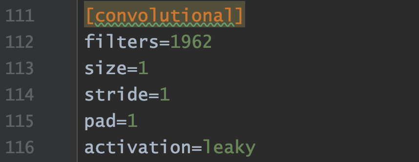
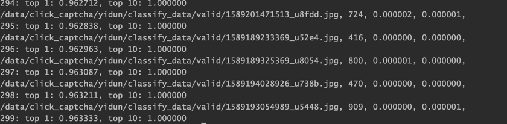

# 点选式验证码识别

点选式验证码的识别分两步——定位和分类。

考虑到[darknet官方文档](https://pjreddie.com/darknet)原生支持定位和分类两种操作，再加上我初学深度学习，这里不用滑动验证码中的**PyTorch**，改用**Darknet**框架

https://github.com/pjreddie/darknet

由于darknet于两年前就没有更新了，需要windows上支持或者需要更多功能的可以参考其分支项目：https://github.com/AlexeyAB/darknet

## 目录结构

```
├── click_captcha
│   ├── LICENSE
│   ├── Makefile	# darknet编译配置
│   ├── README.md
│   ├── darknet	# darknet编译后二进制文件
│   ├── examples
│   │   └── ...
│   ├── include
│   │   └── darknet.h
│   ├── libdarknet.a	# darknet编译后静态库
│   ├── python
│   │   └── ...
│   ├── scripts
│   │   └── ...
│   ├── src
│   │   └── ...
│   ├── weights
│   │   └── download_weight.sh	# 下载darknet预训练权重
│   └── yidun
│       ├── __init__.py
│       ├── checkpoints	# 定位器权重
│       ├── classify_checkpoints	# 分类器权重
│       ├── classify_data
│       │   ├── crop_images	# 分类器训练集
│       │   ├── valid	# 验证集/测试集
│       │   ├── images	# 需要切割的图片
│       │   ├── chinese_classify_image.txt	# 所有需要切割的图片路径
│       │   ├── tools.py	# 生成txt/list文件
│       │   ├── label_chinese_pic.py	# 汉字标注脚本
│       │   ├── label_help.py	# 汉字标注脚本辅助
│       │   ├── get_sample_accuracy.py	# 抽样计算训练集准确率
│       │   ├── labels.txt	# 分类器所有训练集的标签
│       │   ├── train.list	# 分类器所有训练集的图片路径
│       │   └── valid.list	# 分类数所有验证集的图片路径
│       ├── classify_test.py	# 测试分类效果
│       ├── config
│       │   ├── captcha.data	# 定位器训练相关配置
│       │   ├── chinese_classify.cfg
│       │   ├── chinese_classify.data	# 分类器相关配置
│       │   ├── new_chinese_classify.cfg	# 分类器的网络结构
│       │   └── yolov3-captcha.cfg	# 定位器的网络结构
│       ├── darknet.py	# 定位和分类函数调用接口
│       ├── data	# 定位器所需数据
│       │   ├── classes.names
│       │   ├── images
│       │   ├── train.txt
│       │   ├── valid
│       │   └── valid.txt
│       ├── generate_anchorsv3.py
│       ├── results
│       │   ├── anchor.txt
│       │   ├── comp4_det_test_character.txt	# 分类器测试后的结果
│       │   └── convert_det_to_picture.py	# 根据txt结果对图片进行标注
│       ├── spider	# 爬虫
│       │   ├── __init__.py
│       │   ├── core_fp.js
│       │   ├── get_yidun_pic.py
│       │   └── yidun_slider.js
│       ├── run.sh	# 定位器和分类器脚本
│       ├── segment.py	# 汉字切割(配合chinese_classify_image.txt使用)
│       └── yidun_click_detect.py	# 点选识别功能封装
```


## 定位器

### 数据准备

在进行图片爬取之后（图片爬取可参考spider目录）

同样使用YOLOV3网络进行定位。

使用[labelImg](https://github.com/tzutalin/labelImg)进行数据标注，大概标注500张左右即可

1. 将labelImg克隆下来后，修改data/predefined_classes.txt内的内容，这里存放的是classes分类的名称，改成**character**，一分类

2. `python labelImg.py `「打开目录」选择需要标注的图片文件夹，「改变存放目录」选择需要存放标注结果的文件夹，将标注结果「PascalVOC」点击切换成「YOLO」格式。

3. 配合快捷键使用

   > space 将当前图像标记为已验证
   >
   > w 创建一个矩形框
   >
   > d 下一张图片
   >
   > a 上一张图片

 


### 训练

1. data文件夹下的数据都按要求准备完成后，
2. `sh download_weight.sh`下载预训练darknet目标检测权重

3. `sh run.sh yolo_train`即可开始训练



其中的1800：0.248903, 0.234626 avg 分别表示total loss和average loss，越低越好，在0.1-0.8之间效果其实就不错了。

权重模型保存在yidun/checkpoints下


### 测试

`sh run.sh yolo_valid`会生成检测结果到results/comp4_det_test_character.txt下。

生成后可以通过`convert_det_to_picture.py`脚本对验证集图片进行标框，直观查看训练结果。


## 分类器

在跑完定位器后，并再爬取2w张左右原图后，进入分类器的训练

### 数据准备

1. `通过classify_data/tools.py`中的方法生成 chinese_classify_image.txt

2. 运行`segment.py`脚本用上一步训练好的定位器对 chinese_classify_image.txt 内的图片进行切割，保存到`classify_data/crop_images`文件夹下

3. 用`classify_data`文件夹下的`label_chinese_pic.py`脚本进行汉字标注，数据量大可以考虑使用第三方打码平台

4. 打码完成后，可以做一些低词频的剪枝操作，最后通过`get_sample_accuracy.py`抽样验证数据集的准确率，我结合人工打码和AI打码，最终7w张图片准确率在85左右

5. 打码完成后，调用tools里的方法生成valid验证集、train.list、valid.list、labels.txt

6. 根据labels.txt内的标签总数，去`config/new_chinese_classify.cfg`内更新最后一个卷积层的filters数量

   


### 训练

1. 所有文件都已符合要求配置好

2. `sh run.sh classifier_train` 开始训练， loss处于平稳即可停止训练

   权重模型保存在yidun/classify_checkpoints下


### 测试

`sh run.sh classifier_valid`进行验证，最后TOP1 96%，TOP10接近100%




## 集成

对单张图片的点选预测参考`yidun_click_detect.py`文件


## 接口集成及轨迹模拟

统一见behavior_simulation部分


## Tips

1. 点选验证码部分的编码主要参考一位学长的文章，对于一些细节没有说清楚的点，可以参考以下文章链接：

   [破解含语序问题的点击验证码](https://runninggump.github.io/2018/11/19/%E7%A0%B4%E8%A7%A3%E5%90%AB%E8%AF%AD%E5%BA%8F%E9%97%AE%E9%A2%98%E7%9A%84%E7%82%B9%E5%87%BB%E9%AA%8C%E8%AF%81%E7%A0%81/)


2. 其实在训练过程中遇到了很多的问题，最主要是分类模型那部分。网上的模型基本都是从这篇文章中流出的，https://zhuanlan.zhihu.com/p/34186397
是一个简单的三层卷积+池化CNN网络，但是在我的服务器上会出现跑出来模的型验证的分类结果全部都是相同的，也就是不同的输入都产生了相同的输出，猜测是特征 被磨平了，参考了另外两个配置，在每个池化层前增加多个卷积，得以成功。

   https://github.com/supervipcard/163dun-crack/blob/master/classifier.py

   https://github.com/huaiyukeji/verification_code/blob/master/hanzi_detection/cfg/hanzi_clas.cfg

3. 关于点选数据集的问题，我这里有「某盾」的汉字分类数据集，7w+张 85%准确率，打码平台花了快400大洋......不过如果需要的话，请联系我，免费分享，但请只用于学习交流，不要用于非法用途:policeman: :police_car:

