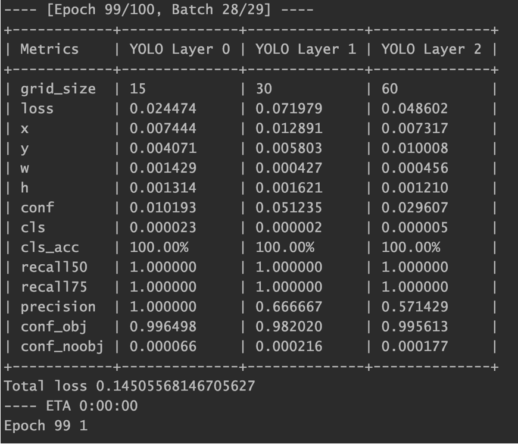

# 滑块式验证码识别

这个模块名其实应该叫slide_captcha，而不是slider。:slightly_smiling_face: Bad English

只介绍通用模型部分（common_train）

基于 https://github.com/eriklindernoren/PyTorch-YOLOv3

## 目录结构

```
├── __init__.py
├── common_train  # 通用模型训练目录
│   ├── __init__.py
│   ├── config
│   │   ├── captcha.data	# 训练相关配置(分类名、训练集、验证集..)
│   │   └── yolov3-captcha.cfg	# yolov3的网络结构
│   ├── data
│   │   ├── classes.names	# 分类的标签名
│   │   ├── get_images.py	# 将其他文件夹的数据集拿过来混合训练
│   │   ├── images	# 训练集和验证集图片
│   │   ├── labels	# 训练集和验证集标注
│   │   ├── result	# 测试结果
│   │   ├── test_images	# 测试集
│   │   ├── train.txt	# 所有训练集图片路径
│   │   └── valid.txt	# 所有验证集图片路径
│   ├── detect.sh	# 测试脚本
│   └── train.sh	# 训练脚本
├── utils
│   ├── __init__.py
│   ├── augmentations.py
│   ├── datasets.py
│   ├── logger.py
│   ├── parse_config.py
│   └── utils.py
├── detect.py
├── models.py
├── test.py
├── train.py
├── prepare.sh	# 获取预训练权重脚本
├── slider_detect.py	# 滑块识别功能封装
...
```


## 数据准备

在进行图片爬取之后（图片爬取可参考每个文件夹的spider目录）

使用[labelImg](https://github.com/tzutalin/labelImg)进行数据标注，由于各个平台滑块风格类似，三个平台总共500张就有不错的效果。

1. 将labelImg克隆下来后，修改data/predefined_classes.txt内的内容，这里存放的是classes分类的名称，改成**target**，一分类

2. `python labelImg.py `「打开目录」选择需要标注的图片文件夹，「改变存放目录」选择需要存放标注结果的文件夹，将标注结果「PascalVOC」点击切换成「YOLO」格式。

3. 配合快捷键使用

   > space 将当前图像标记为已验证
   >
   > w 创建一个矩形框
   >
   > d 下一张图片
   >
   > a 上一张图片


## 训练

1. data文件夹下的数据都按要求准备完成后，
2. `sh prepare.sh`下载预训练darknet目标检测权重

3. `sh train.sh`即可开始训练



100个epoch后，loss大概在0.2附近，置信度接近于1

过程中的和最终的权重模型都保存在checkpoints文件夹下

由于滑动验证码验证时在一定范围内的误差都是会被接受的，精确度并不需要很高，只用框选住的位置，x轴中心点准确即可。


## 测试

`sh detect.sh`会对`data/test_images`测试集下的图片进行检测，结果标注在result文件夹下。


## 集成

对单张图片的滑块预测参考`slider_detect.py`文件


## 接口集成及轨迹模拟

统一见behavior_simulation部分